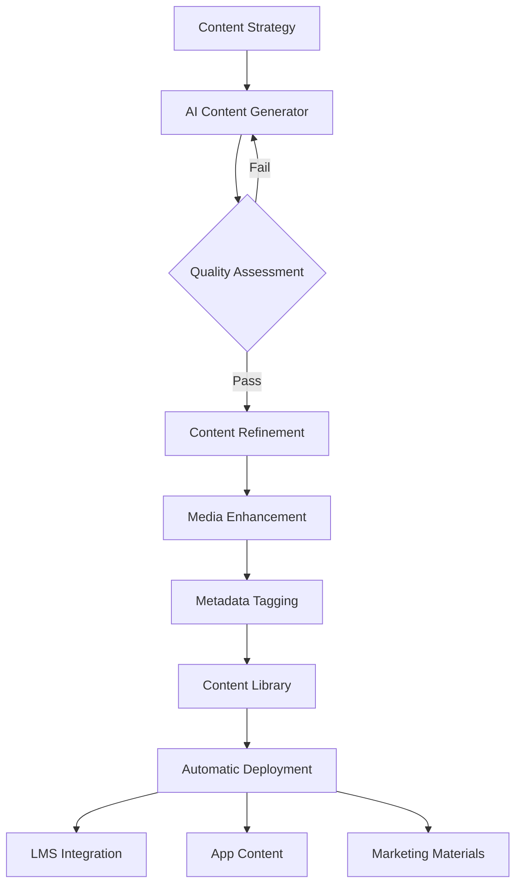
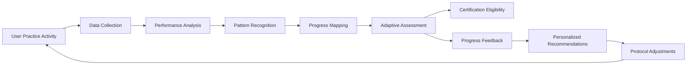

# COSMISTICS: AUTOMATED CONTENT CREATION SYSTEM

## CONTENT GENERATION FRAMEWORK

### AI-Driven Content Pipeline



### Automatic Module Development System

1. **Initial Knowledge Base Construction**
   - Quantum consciousness research database
   - Frequency science repository
   - Sacred geometry information vault
   - Ancient technology research compendium
   - Modern consciousness studies collection

2. **AI Content Generation Framework**
   - GPT-4 based curriculum development
   - Content outline generation from topic maps
   - First-draft text generation with scientific citations
   - Practice protocol development with algorithmic variation
   - Assessment question generation with difficulty scaling

3. **Automated Media Enhancement**
   - Text-to-video generation for lecture content
   - Voice synthesis for guided meditations
   - Procedural sacred geometry animation generation
   - Automatic frequency sound file creation
   - Dynamic visualization rendering

4. **Quality Assurance Automation**
   - NLP-based content evaluation
   - Citation verification system
   - Readability analysis and adjustment
   - Concept mapping for gap identification
   - Automated content testing with sample users

5. **Dynamic Content Assembly**
   - Modular content blocks with intelligent linking
   - Personalized learning pathway assembly
   - Difficulty level adaptive adjustment
   - Prerequisite mapping and enforcement
   - Progress-based content modification

## PERSONALIZED EXPERIENCE AUTOMATION

### Adaptive Learning Algorithm

```python
def generate_learning_path(user_profile, learning_objectives):
    # Initialize personalized pathway
    learning_path = []
    
    # Analyze user profile for strengths and preferences
    strengths = analyze_user_strengths(user_profile)
    preferences = extract_user_preferences(user_profile)
    learning_style = determine_learning_style(user_profile)
    
    # Map learning objectives to content modules
    required_modules = map_objectives_to_modules(learning_objectives)
    
    # Generate customized sequence
    for objective in learning_objectives:
        suitable_modules = find_suitable_modules(objective, required_modules)
        optimal_module = select_optimal_module(
            suitable_modules,
            strengths,
            preferences,
            learning_style
        )
        learning_path.append(optimal_module)
    
    # Optimize sequence for knowledge building
    learning_path = optimize_sequence(learning_path)
    
    return learning_path

def adaptive_content_delivery(user_id, module_id):
    # Get user profile and progress
    user_profile = get_user_profile(user_id)
    user_progress = get_user_progress(user_id)
    learning_style = determine_learning_style(user_profile)
    
    # Get base module content
    base_content = get_module_content(module_id)
    
    # Customize content presentation
    if learning_style == "visual":
        enhanced_content = enhance_visual_elements(base_content)
    elif learning_style == "auditory":
        enhanced_content = enhance_audio_elements(base_content)
    elif learning_style == "kinesthetic":
        enhanced_content = enhance_interactive_elements(base_content)
    
    # Adjust difficulty based on progress
    performance = analyze_user_performance(user_id)
    if performance == "exceeding":
        enhanced_content = increase_difficulty(enhanced_content)
    elif performance == "struggling":
        enhanced_content = decrease_difficulty(enhanced_content)
        enhanced_content = add_supplementary_resources(enhanced_content)
    
    return enhanced_content
```

### Dynamic Practice Generator

1. **Personalized Protocol Builder**
   - Input: User profile, progress metrics, goals
   - Process: Algorithm selects optimal practices
   - Output: Custom daily protocol

2. **Adaptive Difficulty Scaling**
   - Initial baseline assessment
   - Performance-based difficulty adjustment
   - Progress-rate optimization

3. **Variety Generation System**
   - Practice permutation engine
   - Novel combination generation
   - Freshness algorithms to prevent staleness

4. **Time-Adaptive Protocols**
   - Duration flexibility based on user schedule
   - Critical component preservation
   - Effectiveness optimization for time constraints

5. **Goal-Specific Customization**
   - Objective alignment algorithm
   - Targeted practice emphasis
   - Progress acceleration for priority goals

## AUTOMATED ASSESSMENT & CERTIFICATION

### Continuous Evaluation System



### AI-Powered Assessment Components

1. **Practice Analysis Engine**
   - Tracking daily protocol completion
   - Time spent in practice states
   - Pattern consistency evaluation
   - Technique implementation verification
   - Progress rate calculation

2. **Multi-Modal Assessment Tools**
   - Written response semantic analysis
   - Video practice submission evaluation
   - Voice pattern analysis for meditation states
   - Biometric data integration (optional)
   - Field photography analysis

3. **Automated Certification Pipeline**
   - Prerequisite verification
   - Knowledge assessment question generation
   - Practical demonstration evaluation
   - Teaching capability assessment
   - Ethics and standards verification

4. **Progress Visualization System**
   - Automated progress mapping
   - Skill development radar generation
   - Comparative cohort positioning
   - Achievement milestone tracking
   - Projected development timeline

5. **Feedback Generation System**
   - Personalized insight generation
   - Strength identification
   - Growth area highlighting
   - Resource recommendation
   - Next optimal actions suggestion

## CONTENT DEPLOYMENT AUTOMATION

### Multi-Platform Content Distribution

1. **Central Content Repository**
   - Structured content database
   - Modular component organization
   - Version control integration
   - Metadata rich tagging system
   - Dynamic linking infrastructure

2. **Automated Formatting Engine**
   - Platform-specific transformation
   - Device-responsive adaptation
   - Bandwidth-aware optimization
   - Accessibility compliance enforcement
   - Language localization

3. **Scheduled Deployment System**
   - Progress-based unlocking
   - Timed release scheduling
   - Cohort-specific deployment
   - A/B testing integration
   - Performance-based optimization

4. **Cross-Platform Synchronization**
   - LMS content mirroring
   - Mobile app synchronization
   - Community platform integration
   - Email content alignment
   - Marketing material consistency

5. **Usage Analytics Integration**
   - Content effectiveness tracking
   - Engagement metric collection
   - Completion rate monitoring
   - Difficulty assessment
   - Continuous improvement data

## IMPLEMENTATION ROADMAP

### Phase 1: Foundation (Months 1-3)
- Set up AI content generation framework
- Develop initial knowledge base
- Create content templates and style guides
- Build basic assessment algorithms
- Establish content repository infrastructure

### Phase 2: Development (Months 4-6)
- Train AI on quantum consciousness domain
- Implement adaptive learning algorithms
- Develop automated media enhancement
- Create dynamic practice generator
- Build multi-platform deployment system

### Phase 3: Integration (Months 7-9)
- Connect all components into unified system
- Implement quality assurance automation
- Develop certification assessment pipeline
- Create personalization engines
- Build analytics and feedback loops

### Phase 4: Optimization (Months 10-12)
- Fine-tune AI content generation
- Optimize personalization algorithms
- Enhance media generation quality
- Improve assessment accuracy
- Streamline deployment efficiency

## TECHNOLOGY REQUIREMENTS

### AI Systems
- GPT-4 or equivalent for content generation
- Custom-trained models for domain-specific knowledge
- Computer vision for practice evaluation
- Voice recognition for meditation analysis
- Recommendation engines for personalization

### Development Resources
- ML engineers for algorithm development
- AI trainers for domain knowledge integration
- Content experts for quality verification
- UX designers for interface optimization
- System architects for platform integration

### Infrastructure
- High-performance cloud computing
- Media processing capabilities
- Secure content repository
- Distributed delivery network
- Real-time processing systems

### Ongoing Operations
- Model retraining schedule
- Performance monitoring systems
- Content quality verification
- User feedback integration
- Continuous improvement processes