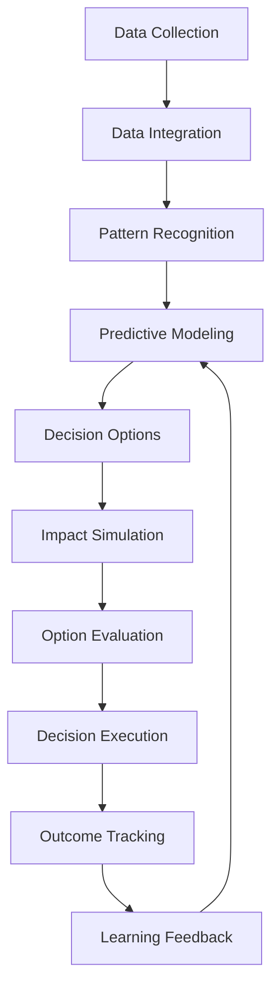
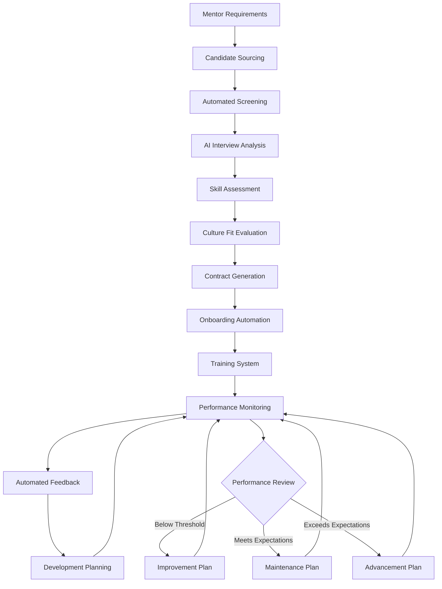

# COSMISTICS: AUTOMATED OPERATIONS & BUSINESS MANAGEMENT

## INTELLIGENT BUSINESS OPERATIONS

### Automated Decision-Making System



### Key Business Automation Components

1. **Executive Intelligence Dashboard**
- Real-time performance metrics
- Trend identification
- Anomaly detection
- Opportunity spotting
- Risk assessment
1. **Automated Decision Framework**
- Decision criteria establishment
- Option generation algorithms
- Impact modeling
- Probability assessment
- Recommendation generation
1. **Resource Optimization System**
- Dynamic budget allocation
- Staff utilization optimization
- Infrastructure scaling
- Inventory management
- Cash flow optimization
1. **Predictive Business Modeling**
- Revenue forecasting
- Cost projection
- Market trend analysis
- Competitive positioning
- Growth opportunity identification
1. **Regulatory Compliance Automation**
- Regulation monitoring
- Compliance checking
- Documentation automation
- Audit preparation
- Risk management

## FINANCIAL AUTOMATION SYSTEM

### Intelligent Financial Management

```typescript
interface FinancialTransactionRecord {
    timestamp: Date;
    amount: number;
    type: 'revenue' | 'expense' | 'investment' | 'transfer';
    category: string;
    subCategory: string;
    paymentMethod: string;
    relatedCustomerId?: string;
    relatedProductId?: string;
    notes?: string;
}

class FinancialAutomationSystem {
    private transactions: FinancialTransactionRecord[] = [];
    private budgets: Map<string, number> = new Map();
    private forecastModels: any = {};
    private cashFlowProjections: any = {};
    private profitabilityAnalysis: any = {};
    
    constructor() {
        this.initializeSystem();
    }
    
    private initializeSystem(): void {
        this.loadHistoricalData();
        this.buildForecastModels();
        this.establishBudgets();
        this.scheduledDataUpdates();
    }
    
    public recordTransaction(transaction: FinancialTransactionRecord): void {
        // Validate transaction
        if (!this.validateTransaction(transaction)) {
            throw new Error('Invalid transaction data');
        }
        
        // Process and categorize transaction
        const processedTransaction = this.processTransaction(transaction);
        
        // Store transaction
        this.transactions.push(processedTransaction);
        
        // Update affected systems
        this.updateCashFlowProjections();
        this.updateProfitabilityAnalysis();
        this.checkBudgetImplications(processedTransaction);
        this.assessFinancialHealth();
    }
    
    public generateFinancialReports(reportType: string, period: string): any {
        switch (reportType) {
            case 'income-statement':
                return this.generateIncomeStatement(period);
            case 'balance-sheet':
                return this.generateBalanceSheet();
            case 'cash-flow':
                return this.generateCashFlowStatement(period);
            case 'budget-performance':
                return this.generateBudgetPerformance(period);
            case 'profitability-analysis':
                return this.getProfitabilityAnalysis(period);
            case 'forecast':
                return this.getFinancialForecast(period);
            default:
                throw new Error('Unsupported report type');
        }
    }
    
    public optimizeFinancialResources(): any {
        const optimizationOpportunities = [];
        
        // Identify cost reduction opportunities
        optimizationOpportunities.push(...this.identifyCostReductionOpportunities());
        
        // Identify revenue optimization opportunities
        optimizationOpportunities.push(...this.identifyRevenueOptimizationOpportunities());
        
        // Identify cash flow optimization opportunities
        optimizationOpportunities.push(...this.identifyCashFlowOptimizationOpportunities());
        
        // Prioritize opportunities
        return this.prioritizeOptimizationOpportunities(optimizationOpportunities);
    }
    
    public automatedFinancialDecisionMaking(situation: string): any {
        // Analyze situation
        const context = this.analyzeFinancialSituation(situation);
        
        // Generate options
        const options = this.generateFinancialOptions(context);
        
        // Simulate outcomes
        const simulatedOutcomes = this.simulateFinancialOutcomes(options);
        
        // Select optimal solution
        return this.selectOptimalFinancialSolution(simulatedOutcomes);
    }
}
```

### Automated Finance Components

1. **Intelligent Accounting System**
- Automated transaction categorization
- Real-time financial statement generation
- Anomaly detection and flagging
- Tax optimization
- Audit-ready documentation
1. **Predictive Financial Planning**
- Cash flow forecasting
- Dynamic budget adjustment
- Investment opportunity identification
- Risk exposure modeling
- Scenario planning automation
1. **Revenue Optimization Engine**
- Pricing optimization algorithms
- Discount strategy automation
- Revenue stream diversification recommendations
- Customer lifetime value maximization
- Profitability analysis
1. **Expense Management Automation**
- Vendor optimization
- Cost reduction opportunity identification
- Resource allocation efficiency
- Expense approval automation
- Spending pattern analysis
1. **Financial Health Monitoring**
- KPI dashboard generation
- Trend analysis and alerting
- Competitive benchmarking
- Financial risk assessment
- Opportunity cost analysis

## AUTOMATED HUMAN RESOURCES

### Mentor Management Automation



### HR Automation Components

1. **Intelligent Recruiting System**
- Candidate sourcing automation
- Resume/CV parsing and analysis
- Qualification matching algorithms
- Automated initial screening
- Interview scheduling and management
1. **Mentor Performance Optimization**
- Performance metrics tracking
- Student satisfaction analysis
- Teaching effectiveness evaluation
- Content delivery assessment
- Personalized improvement recommendations
1. **Training Automation System**
- Personalized learning paths
- Skill gap identification
- Automated content delivery
- Progress tracking
- Certification management
1. **Team Optimization System**
- Workload balancing algorithms
- Skill complementarity analysis
- Team composition optimization
- Collaboration effectiveness monitoring
- Conflict prevention intelligence
1. **Contractor Management System**
- Project requirement specification
- Contractor matching algorithms
- Work quality monitoring
- Automated payment processing
- Performance evaluation automation

## INTELLIGENT PRODUCT MANAGEMENT

### Automated Product Development

```python
class ProductDevelopmentSystem:
    def __init__(self, market_data, user_feedback, usage_analytics):
        self.market_data = market_data
        self.user_feedback = user_feedback
        self.usage_analytics = usage_analytics
        self.product_roadmap = []
        self.development_pipeline = []
        self.testing_results = []
        
    def identify_product_opportunities(self):
        # Analyze user needs from feedback
        user_needs = self.analyze_user_feedback()
        
        # Identify market gaps
        market_gaps = self.analyze_market_gaps()
        
        # Determine usage patterns
        usage_patterns = self.analyze_usage_patterns()
        
        # Synthesize opportunities
        opportunities = self.synthesize_opportunities(
            user_needs, market_gaps, usage_patterns
        )
        
        # Prioritize opportunities
        return self.prioritize_opportunities(opportunities)
    
    def generate_product_concepts(self, opportunities):
        concepts = []
        
        for opportunity in opportunities:
            # Generate multiple concepts for each opportunity
            opportunity_concepts = []
            
            # Create concept variations
            for i in range(5):
                concept = self.create_concept_variation(opportunity)
                opportunity_concepts.append(concept)
            
            # Evaluate and select best concepts
            evaluated_concepts = self.evaluate_concepts(opportunity_concepts)
            best_concept = self.select_best_concept(evaluated_concepts)
            
            concepts.append(best_concept)
        
        return concepts
    
    def develop_product_specs(self, selected_concept):
        # Generate feature list
        features
```